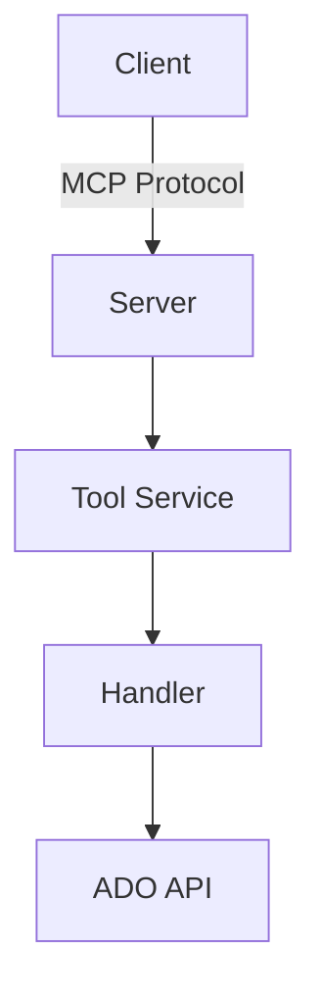

# Documentation Instructions

This directory contains user-facing documentation, architectural guides, and feature specifications.

## Documentation Structure

```
docs/
├── feature_specs/           # Feature specifications (REQUIRED for all features)
│   ├── toc.yml             # Table of contents
│   └── *.md                # Individual feature specs
├── AI_POWERED_FEATURES.md  # Overview of AI capabilities
├── ARCHITECTURE.md         # System architecture
├── CONTRIBUTING.md         # Contribution guidelines
├── MODEL_SELECTION.md      # LLM model selection guide
└── *.md                    # Other guides and references
```

## Documentation Standards

### File Naming Conventions

- Feature specs: `kebab-case.md` (e.g., `query-handle-pattern.md`)
- Major docs: `SCREAMING_SNAKE_CASE.md` (e.g., `ARCHITECTURE.md`)
- Guides: `SCREAMING_SNAKE_CASE.md` (e.g., `WIQL_BEST_PRACTICES.md`)

### Markdown Formatting

```markdown
# Title (H1 - Once per document)

## Section (H2 - Main sections)

### Subsection (H3 - Details)

#### Minor Section (H4 - Use sparingly)

**Bold** for emphasis
*Italic* for slight emphasis
`code` for inline code
```

### Code Blocks

Always specify language:
````markdown
```typescript
const example: string = "code";
```

```bash
npm run build
```

```json
{
  "key": "value"
}
```
````

## Feature Specifications (REQUIRED)

### When to Create a Feature Spec

**REQUIRED for:**
- Every new MCP tool
- Every new service or analyzer
- Every new prompt template
- Major feature additions
- Significant behavior changes

**Create at:** `docs/feature_specs/<feature-name>.md`

### Feature Spec Template

```markdown
# [Feature Name]

**Status:** [Implemented | Planned | Deprecated]  
**Version:** [When added/modified]  
**MCP Tool:** `tool-name` (if applicable)

## Overview

Brief 2-3 sentence description of what this feature does and why it exists.

## Purpose

Detailed explanation of the problem this solves and use cases.

## User-Facing Behavior

How users interact with this feature. Include:
- How to invoke (CLI command, tool call, etc.)
- What happens when invoked
- Expected output or side effects

## Input Parameters

### Required Parameters

| Parameter | Type | Description | Example |
|-----------|------|-------------|---------|
| `param1` | `string` | What it does | `"value"` |
| `param2` | `number` | What it does | `123` |

### Optional Parameters

| Parameter | Type | Default | Description | Example |
|-----------|------|---------|-------------|---------|
| `param3` | `boolean` | `false` | What it does | `true` |

### Configuration

Parameters that can be set in `.ado-mcp-config.json`:

```json
{
  "featureName": {
    "setting1": "value",
    "setting2": 123
  }
}
```

## Output Format

### Success Response

```json
{
  "success": true,
  "data": {
    "field1": "value",
    "field2": 123
  },
  "errors": [],
  "warnings": []
}
```

### Error Response

```json
{
  "success": false,
  "data": null,
  "errors": ["Error message"],
  "warnings": []
}
```

## Examples

### Example 1: Basic Usage

**Input:**
```json
{
  "param1": "value",
  "param2": 123
}
```

**Output:**
```json
{
  "success": true,
  "data": { "result": "..." }
}
```

### Example 2: Error Case

**Input:**
```json
{
  "param1": null
}
```

**Output:**
```json
{
  "success": false,
  "errors": ["param1 is required"]
}
```

## Error Handling

### Common Errors

| Error Message | Cause | Resolution |
|--------------|-------|------------|
| "Not found" | Invalid ID | Check ID exists |
| "Unauthorized" | Not logged in | Run `az login` |

### Error Recovery

How the feature handles errors and recovers.

## Implementation Details

### Key Components

- **Service:** `src/services/my-service.ts`
- **Handler:** `src/services/handlers/my-handler.ts`
- **Schema:** `src/config/schemas.ts` (`myToolSchema`)
- **Prompt:** `prompts/system/my-prompt.md` (if AI-powered)

### Integration Points

- Depends on: [List dependencies]
- Used by: [List consumers]
- External APIs: [Azure DevOps, etc.]

### AI Features (if applicable)

- **Prompt Template:** `prompts/system/prompt-name.md`
- **Analyzer:** `src/services/analyzers/analyzer-name.ts`
- **Requires:** VS Code Language Model API

## Testing

### Test Files

- Unit tests: `test/unit/my-feature.test.ts`
- Integration tests: `test/integration/my-feature-integration.test.ts`

### Test Coverage

- [x] Valid input handling
- [x] Invalid input rejection
- [x] Error handling
- [x] Configuration merging
- [ ] Edge cases

### Manual Testing

```bash
# How to manually test this feature
npm run dev
# ... steps to test
```

## Related Features

- [Related Feature 1](./related-feature.md)
- [Related Feature 2](./another-feature.md)

## Changelog

- **v1.5.0** (2025-10-07) - Initial implementation
- **v1.6.0** (2025-10-15) - Added feature X

## References

- [External documentation]
- [Related GitHub issues]
- [Design decisions]

---

**Last Updated:** 2025-10-07  
**Author:** [Your name or team]
```

### Updating Feature Specs

**When modifying a feature:**
1. Update the corresponding feature spec
2. Increment version in changelog section
3. Update "Last Updated" date
4. Update affected sections (inputs, outputs, behavior)
5. Add entry to changelog with date and changes

## Table of Contents (toc.yml)

### Structure

```yaml
# Feature Specifications Table of Contents

features:
  - category: "Work Item Operations"
    items:
      - name: "Create Work Item"
        file: "create-work-item.md"
        status: "Implemented"
      - name: "Query Handle Pattern"
        file: "query-handle-pattern.md"
        status: "Implemented"
  
  - category: "AI-Powered Analysis"
    items:
      - name: "AI Assignment Analysis"
        file: "ai-assignment-analysis.md"
        status: "Implemented"

  - category: "Bulk Operations"
    items:
      - name: "Bulk Update"
        file: "bulk-update.md"
        status: "Planned"
```

### Adding to TOC

**When creating a new feature spec:**
1. Open `docs/feature_specs/toc.yml`
2. Find appropriate category or create new one
3. Add entry with name, file, and status
4. Keep alphabetical within category
5. Commit with feature spec

## Writing Guidelines

### Voice and Tone

- **Active voice:** "The tool creates a work item" (not "A work item is created")
- **Present tense:** "Returns a result" (not "Will return")
- **Direct:** Avoid unnecessary words
- **Technical but accessible:** Explain jargon on first use

### Examples

✅ **Good:**
```markdown
The `create-work-item` tool creates a new work item in Azure DevOps. 
Specify the work item type, title, and optional description.
```

❌ **Bad:**
```markdown
The create-work-item tool can be used to create new work items. You 
might want to use this tool when you need to add items to Azure DevOps. 
It will create the item if you provide the necessary parameters.
```

### Technical Accuracy

- Test all code examples
- Verify parameter names match schemas
- Include actual output from tools
- Update when implementation changes

## Common Documentation Sections

### Architecture Docs

Update `ARCHITECTURE.md` when:
- Adding new service or major component
- Changing data flow patterns
- Introducing new external dependencies
- Modifying authentication mechanism

### API Reference

Include in feature specs:
- All parameters with types
- Return values with types
- Error conditions
- Code examples

### Tutorials and Guides

- Step-by-step instructions
- Complete working examples
- Common pitfalls and solutions
- Links to related features

## Diagrams and Visuals

### Mermaid Diagrams

```markdown
## Architecture


```

### ASCII Diagrams

For simple flows:
```
Client → Server → Service → API
         ↓
       Cache
```

### When to Use Visuals

- Complex workflows (sequence diagrams)
- System architecture (component diagrams)
- State machines (state diagrams)
- Data flow (flow charts)

## Documentation Policy

### What NOT to Create (Unless Explicitly Requested)

❌ **Forbidden:**
- Summary files (`*_SUMMARY.md`, `*_COMPLETE.md`, `*_REPORT.md`)
- Implementation status documents
- Changelog files (use git commits)
- Redundant guides (update existing instead)
- Analysis reports
- Work completion summaries

✅ **Instead:**
- Update existing documentation
- Add to feature specs
- Use git commit messages
- Update ARCHITECTURE.md if needed

### When User Asks for Documentation

**If request is vague:**
1. Ask what specific documentation they need
2. Suggest updating existing docs
3. Offer to use git commit messages
4. Only create new docs if they explicitly confirm

**If request is specific:**
- Create/update the specific document requested
- Follow templates and conventions
- Update TOC if needed

## Documentation Maintenance

### Regular Updates

- Review quarterly for accuracy
- Update version numbers
- Check links aren't broken
- Ensure code examples still work
- Update screenshots/diagrams if UI changed

### Deprecation

When deprecating a feature:
1. Update feature spec status to "Deprecated"
2. Add deprecation notice at top
3. Explain replacement or alternative
4. Keep doc for reference (don't delete)

```markdown
# [Feature Name]

**Status:** Deprecated  
**Deprecated in:** v1.6.0  
**Removed in:** v2.0.0  
**Alternative:** Use [New Feature](./new-feature.md) instead

> ⚠️ **DEPRECATED:** This feature is deprecated and will be removed...
```

## Style Guide

### Headings

- Use sentence case: "Creating work items" (not "Creating Work Items")
- Be descriptive: "Adding a new tool" (not "New tools")
- Avoid questions in headings

### Lists

- Parallel structure (all items same grammatical form)
- Complete sentences if explaining concepts
- Fragments if listing items

### Code References

- Backticks for inline: `functionName`, `parameter`, `"value"`
- Full file paths: `src/services/my-service.ts`
- Tool names: `create-work-item` (with backticks)

### Links

```markdown
[Descriptive text](./relative-file.md)
[External resource](https://example.com)
[Section link](#section-heading)
```

## Documentation Review Checklist

Before committing documentation:

- [ ] Spell check completed
- [ ] Code examples tested
- [ ] Links verified
- [ ] TOC updated (if feature spec)
- [ ] Version/date updated
- [ ] Follows naming conventions
- [ ] Includes all required sections
- [ ] Clear and concise
- [ ] Technically accurate

---

**Last Updated:** 2025-10-07
