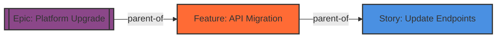
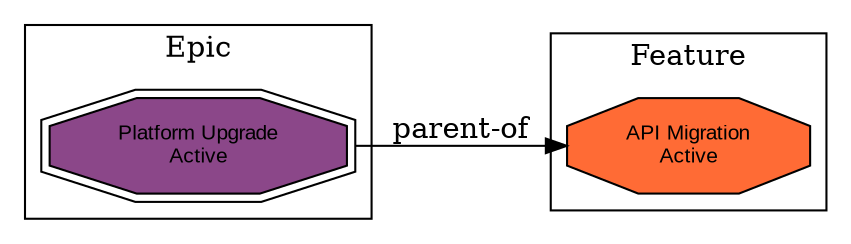

# Dependency Visualization Feature

## Overview

The dependency visualization feature generates visual graphs showing work item relationships in Azure DevOps. It supports multiple export formats (Graphviz DOT and Mermaid) and provides intelligent filtering and layout options to create readable, informative dependency diagrams.

**Key Benefits:**
- **Understand complex hierarchies** - Visualize Epic → Feature → Story → Task breakdowns
- **Identify blockers** - See dependency chains and blocking relationships
- **Sprint planning** - Visualize work item dependencies for sprint scope
- **Backlog management** - Understand parent-child relationships and work structure

## MCP Tool

### Tool Name
`visualize-dependencies`

### Input Parameters

| Parameter | Type | Required | Default | Description |
|-----------|------|----------|---------|-------------|
| `queryHandle` | string | Yes* | - | Query handle from `query-wiql` (use this OR `workItemIds`) |
| `workItemIds` | number[] | Yes* | - | Array of work item IDs to visualize (use this OR `queryHandle`) |
| `format` | 'dot' \| 'mermaid' | No | 'mermaid' | Export format |
| `relationTypes` | array | No | ['all'] | Relationship types to include |
| `maxDepth` | number | No | 3 | Maximum traversal depth (1-10) |
| `maxNodes` | number | No | 100 | Maximum nodes in graph (10-500) |
| `layoutDirection` | 'LR' \| 'TB' \| 'RL' \| 'BT' | No | 'LR' | Layout direction |
| `groupByType` | boolean | No | false | Group nodes by type (DOT only) |
| `includeMetadata` | boolean | No | true | Include type/state in labels |
| `colorByState` | boolean | No | false | Color by state instead of type |
| `organization` | string | No | config | Azure DevOps organization |
| `project` | string | No | config | Azure DevOps project |

*Either `queryHandle` or `workItemIds` must be provided

#### Relationship Types
- `all` - All relationship types
- `parent-child` - Hierarchical parent-child links
- `blocks` - Dependency/blocking relationships
- `related` - Related work item links
- `depends-on` - Explicit dependencies

#### Layout Directions
- `LR` - Left to right (good for hierarchies)
- `TB` - Top to bottom (good for workflows)
- `RL` - Right to left
- `BT` - Bottom to top

### Output Format

```json
{
  "success": true,
  "data": {
    "diagram": "<DOT or Mermaid string>",
    "format": "mermaid",
    "summary": {
      "total_nodes": 25,
      "total_edges": 30,
      "nodes_by_type": {
        "Epic": 2,
        "Feature": 5,
        "User Story": 10,
        "Task": 8
      },
      "edges_by_relation": {
        "parent-child": 28,
        "related": 2
      },
      "truncated": false
    },
    "rendering_instructions": "<How to render the diagram>",
    "usage_hint": "VS Code has built-in Mermaid support!..."
  },
  "metadata": {
    "tool": "visualize-dependencies",
    "timestamp": "2025-11-18T10:30:00Z",
    "organization": "myorg",
    "project": "MyProject",
    "input_work_items": 5,
    "output_nodes": 25,
    "output_edges": 30
  }
}
```

## Export Formats

### Mermaid Diagram

**Best for:**
- VS Code (built-in support)
- GitHub/Azure DevOps markdown files
- Quick visualization without external tools

**Features:**
- Different shapes for work item types (boxes, diamonds, octagons)
- Color coding by type or state
- Clickable in many viewers
- Native rendering in VS Code preview

**Example:**


### Graphviz DOT Format

**Best for:**
- Professional publication-quality graphs
- Complex diagrams with many nodes
- Advanced layout control
- PDF/PNG/SVG export

**Features:**
- Subgraph clustering by work item type
- Rich styling options
- Multiple output formats (PNG, SVG, PDF)
- Advanced layout algorithms

**Example:**


## Usage Examples

### Example 1: Visualize Sprint Dependencies

```javascript
// First, query for sprint work items
const sprintQuery = await queryWiql({
  description: "Show all active items in current sprint"
});

// Then visualize the dependencies
const visualization = await visualizeDependencies({
  queryHandle: sprintQuery.data.query_handle,
  format: "mermaid",
  relationTypes: ["parent-child", "blocks"],
  maxDepth: 3,
  colorByState: true  // Show progress with colors
});

// Save to markdown file
fs.writeFileSync('sprint-dependencies.md', `
# Sprint Dependencies

\`\`\`mermaid
${visualization.data.diagram}
\`\`\`
`);
```

### Example 2: Epic Breakdown Visualization

```javascript
// Visualize a specific Epic's hierarchy
const epicViz = await visualizeDependencies({
  workItemIds: [12345],  // Epic ID
  format: "dot",
  relationTypes: ["parent-child"],
  maxDepth: 5,  // Show full hierarchy
  groupByType: true,
  includeMetadata: true
});

// Render to PNG using Graphviz
fs.writeFileSync('epic-breakdown.dot', epicViz.data.diagram);
// Run: dot -Tpng epic-breakdown.dot -o epic-breakdown.png
```

### Example 3: Identify Blockers

```javascript
// Find all blocked work items
const blockedQuery = await queryWiql({
  description: "Show all items with blocking dependencies"
});

// Visualize blocker chains
const blockerViz = await visualizeDependencies({
  queryHandle: blockedQuery.data.query_handle,
  format: "mermaid",
  relationTypes: ["blocks", "depends-on"],
  maxDepth: 2,
  layoutDirection: "TB"  // Top-to-bottom for flow
});
```

### Example 4: Focused Hierarchy View

```javascript
// Show just the immediate children of a Feature
const featureViz = await visualizeDependencies({
  workItemIds: [67890],
  format: "mermaid",
  relationTypes: ["parent-child"],
  maxDepth: 1,  // Only immediate children
  maxNodes: 50,
  includeMetadata: true
});
```

## Rendering Instructions

### Mermaid Diagrams

#### VS Code (Built-in)
1. Save diagram in a `.md` file inside a ` ```mermaid ` code block
2. Open Markdown preview (Ctrl+Shift+V)
3. Diagram renders automatically

#### Online Viewers
- [Mermaid Live Editor](https://mermaid.live/) - Paste and export
- GitHub/Azure DevOps - Works in markdown files

#### CLI Tool
```bash
npm install -g @mermaid-js/mermaid-cli
mmdc -i diagram.mmd -o diagram.png
mmdc -i diagram.mmd -o diagram.svg
```

### DOT (Graphviz) Diagrams

#### Command Line
```bash
# Install Graphviz: https://graphviz.org/download/

# Render to PNG
dot -Tpng dependencies.dot -o dependencies.png

# Render to SVG (scalable)
dot -Tsvg dependencies.dot -o dependencies.svg

# Render to PDF
dot -Tpdf dependencies.dot -o dependencies.pdf

# Use different layout engines
neato -Tpng dependencies.dot -o dependencies.png    # Force-directed
circo -Tpng dependencies.dot -o dependencies.png    # Circular
```

#### VS Code Extensions
- "Graphviz Interactive Preview" extension
- Open `.dot` file and use "Preview Graphviz / DOT" command

#### Online Viewers
- [GraphvizOnline](https://dreampuf.github.io/GraphvizOnline/)
- [Edotor](https://edotor.net/)

## Implementation Details

### Architecture

```
visualize-dependencies (tool)
  ↓
handleVisualizeDependencies (handler)
  ↓
visualization-service.ts
  ├── buildDependencyGraph() - Traverse relationships
  ├── exportAsDot() - Generate DOT format
  └── exportAsMermaid() - Generate Mermaid format
```

### Graph Building Process

1. **Initialize** - Start with query handle or work item IDs
2. **Traverse** - Breadth-first traversal of relationships up to maxDepth
3. **Filter** - Apply relationship type filters
4. **Limit** - Stop at maxNodes to prevent huge graphs
5. **Export** - Generate DOT or Mermaid output with styling

### Node Styling

#### Color by Type (Default)
- **Epic** - Purple (#8B4789)
- **Feature** - Orange (#FF6B35)
- **Story/PBI** - Blue (#4A90E2)
- **Task** - Emerald (#50C878)
- **Bug** - Red (#E63946)

#### Color by State
- **New** - Sky blue (#87CEEB)
- **Active** - Gold (#FFD700)
- **Resolved/Done** - Light green (#90EE90)
- **Removed** - Light gray (#D3D3D3)

#### Shapes (Mermaid)
- **Epic** - Double box `[[ ]]`
- **Feature** - Regular box `[ ]`
- **Bug** - Diamond `{ }`
- **Task** - Circle `(( ))`

#### Shapes (DOT/Graphviz)
- **Epic** - doubleoctagon
- **Feature** - octagon
- **Story** - box
- **Task** - ellipse
- **Bug** - diamond

## Performance Considerations

### Graph Size Limits
- **Default maxNodes: 100** - Good for most use cases
- **Maximum maxNodes: 500** - Large but still readable
- **maxDepth: 3** - Usually sufficient for understanding structure

### API Calls
- 1 API call per work item fetched
- Batch fetching not used (needs relations data per item)
- Typical graph (50 nodes) = ~50 API calls

### Optimization Tips
1. **Filter relationship types** - Only include what you need
2. **Reduce maxDepth** - Start with 2-3, increase if needed
3. **Use query handles** - Pre-filter work items before visualizing
4. **Group related visualizations** - One large query, multiple filtered views

## Use Cases

### 1. Sprint Planning
**Goal:** Understand work item dependencies in upcoming sprint

```javascript
const sprint = await queryWiql({
  description: "All items in Sprint 42"
});

await visualizeDependencies({
  queryHandle: sprint.data.query_handle,
  format: "mermaid",
  relationTypes: ["parent-child", "blocks"],
  colorByState: true  // See what's complete vs in-progress
});
```

### 2. Epic Breakdown Validation
**Goal:** Verify Epic → Feature → Story hierarchy is complete

```javascript
await visualizeDependencies({
  workItemIds: [epicId],
  format: "dot",
  relationTypes: ["parent-child"],
  maxDepth: 5,
  groupByType: true  // Show hierarchy levels clearly
});
```

### 3. Blocker Analysis
**Goal:** Identify dependency chains causing delays

```javascript
const blocked = await queryWiql({
  wiqlQuery: "SELECT [System.Id] FROM WorkItems WHERE [System.State] <> 'Closed' AND [System.Tags] CONTAINS 'Blocked'"
});

await visualizeDependencies({
  queryHandle: blocked.data.query_handle,
  relationTypes: ["blocks", "depends-on"],
  maxDepth: 2,
  layoutDirection: "TB"  // Show flow of blockers
});
```

### 4. Work Item Hierarchy Validation
**Goal:** Find orphaned work items or incorrect parent relationships

```javascript
const allActive = await queryWiql({
  description: "All active work items in my area"
});

const graph = await visualizeDependencies({
  queryHandle: allActive.data.query_handle,
  relationTypes: ["parent-child"],
  maxDepth: 10,
  maxNodes: 300
});

// Check summary for disconnected components
if (graph.data.summary.total_edges < graph.data.summary.total_nodes - 1) {
  console.log("Warning: Disconnected work items detected");
}
```

## Error Handling

### Common Errors

**Invalid or expired query handle:**
```json
{
  "success": false,
  "errors": ["Invalid or expired query handle: qh_abc123"]
}
```

**No work items found:**
```json
{
  "success": false,
  "errors": ["No work items found to visualize"]
}
```

**Work item fetch failure:**
- Fails gracefully - skips unreachable work items
- Logs warning and continues with available data

### Warnings

**Graph truncated:**
```json
{
  "success": true,
  "warnings": [
    "Graph truncated at 100 nodes. Consider filtering by relationship type or reducing maxDepth."
  ]
}
```

## Testing

### Manual Testing

```bash
# Build the project
npm run build

# Test basic visualization
node -e "
const { handleVisualizeDependencies } = require('./build/services/handlers/visualization/visualize-dependencies.handler.js');
handleVisualizeDependencies({ workItemIds: [123], format: 'mermaid' }).then(console.log);
"
```

### Example Test Cases

1. **Single work item** - Should show item + immediate relations
2. **Empty query handle** - Should return error
3. **Large hierarchy** - Should respect maxNodes limit
4. **Cyclic dependencies** - Should handle gracefully (visit once)
5. **Mixed relationship types** - Should filter correctly
6. **Both formats** - DOT and Mermaid both render correctly

## Future Enhancements

### Potential Features
- **Automatic layout optimization** - Smart layout based on graph structure
- **Interactive HTML export** - Clickable nodes linking to Azure DevOps
- **PNG/SVG direct rendering** - Generate images without external tools
- **Diff visualization** - Compare two time points to see changes
- **Critical path highlighting** - Emphasize longest dependency chains
- **Team coloring** - Color nodes by assigned team
- **Iteration timeline** - Show iteration boundaries on timeline view

## Version History

### v1.0.0 (2025-11-18)
- Initial release
- Graphviz DOT export
- Mermaid diagram export
- Relationship filtering
- Depth and node limiting
- Color schemes (type and state)
- VS Code integration guidance
